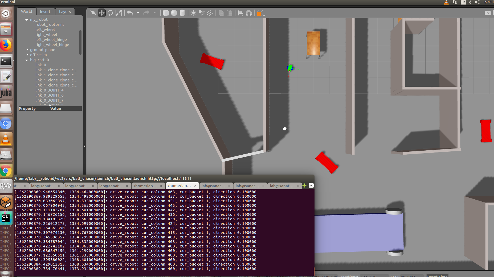
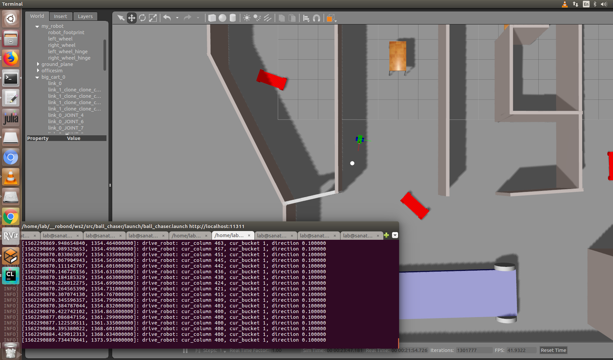
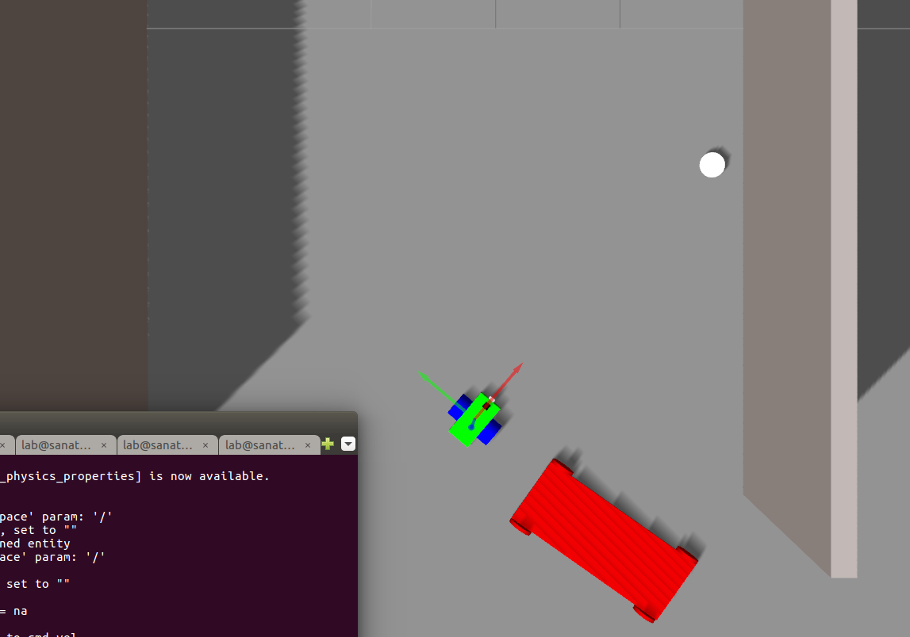
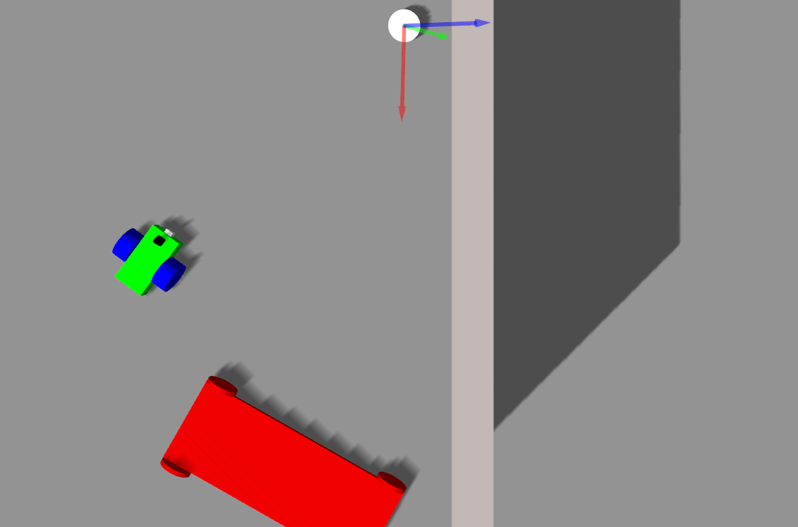
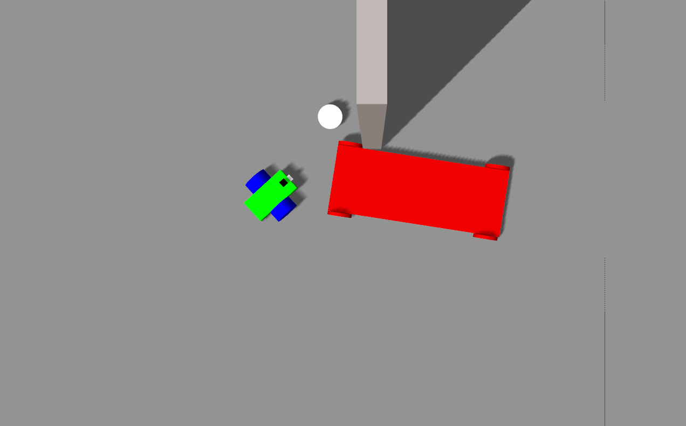

[](https://www.udacity.com/robotics)

# Go Chase It
Project Description
Summary of Tasks

In this project, you should create two ROS packages inside your catkin_ws/src: the drive_bot and the ball_chaser. Here are the steps to design the robot, house it inside your world, and program it to chase white-colored balls:

    drive_bot:
        Create a my_robot ROS package to hold your robot, the white ball, and the world.
        Design a differential drive robot with the Unified Robot Description Format. Add two sensors to your robot: a lidar and a camera. Add Gazebo plugins for your robot’s differential drive, lidar, and camera. The robot you design should be significantly different from the one presented in the project lesson. Implement significant changes such as adjusting the color, wheel radius, and chassis dimensions. Or completely redesign the robot model! After all you want to impress your future employers :-D
        House your robot inside the world you built in the Build My World project.
        Add a white-colored ball to your Gazebo world and save a new copy of this world.
        The world.launch file should launch your world with the white-colored ball and your robot.

    ball_chaser:
        Create a ball_chaser ROS package to hold your C++ nodes.
        Write a drive_botC++ node that will provide a ball_chaser/command_robot service to drive the robot by controlling its linear x and angular z velocities. The service should publish to the wheel joints and return back the requested velocities.
        Write a process_image C++ node that reads your robot’s camera image, analyzes it to determine the presence and position of a white ball. If a white ball exists in the image, your node should request a service via a client to drive the robot towards it.
        The ball_chaser.launch should run both the drive_bot and the process_image nodes.

The robot you design in this project will be used as a base model for all your upcoming projects in this Robotics Software Engineer Nanodegree Program.
Evaluation
 

 The directory structure and contain all the files listed here:

    .ws2                          # Go Chase It Project
     ├── src
     │  ├── my_robot                       # my_robot package                   
     │  │   ├── launch                     # launch folder for launch files   
     │  │   │   ├── robot_description.launch
     │  │   │   ├── world.launch
     │  │   ├── meshes                     # meshes folder for sensors
     │  │   │   ├── hokuyo.dae
     │  │   ├── urdf                       # urdf folder for xarco files
     │  │   │   ├── my_robot.gazebo
     │  │   │   ├── my_robot.xacro
     │  │   ├── world                      # world folder for world files
     │  │   │   ├── <yourworld>.world
     │  │   ├── CMakeLists.txt             # compiler instructions
     │  │   ├── package.xml                # package info
     │  ├── ball_chaser                    # ball_chaser package                   
     │  │   ├── launch                     # launch folder for launch files   
     │  │   │   ├── ball_chaser.launch
     │  │   ├── src                        # source folder for C++ scripts
     │  │   │   ├── drive_bot.cpp
     │  │   │   ├── process_images.cpp
     │  │   ├── srv                        # service folder for ROS services
     │  │   │   ├── DriveToTarget.srv
     │  │   ├── CMakeLists.txt             # compiler instructions
     │  │   ├── package.xml                # package info                  
     │  └──                              
     ├── my_ball                            # white ball
     │  └──   model.config
     │  └──   model.sdf
     │  
     ├── images                            # results screen shots
     │  
     
      
     
     
     
## Contents
There are 2 packages:<br>
* **ball_chaser** is for detection of a white ball, and motion planning.
* **my_robot** contains gazebo environemnts for the robot.

Note that some example snapshots of the robot simulator can be found inside the folder **images/**.

## Usage 

#### Step 1 

launch simulator. 
```
$ roslaunch my_robot world.launch
```
#### Step 2

Launch the ball following nodes/service.

```
$ roslaunch ball_chaser ball_chaser.launch
```

##  
#### detect white ball and start chasing


#### chase in acion 


#### chase in acion ( move ball to other position)


#### chase in acion ( move ball to other position)



#### chase in acion ( move ball to other position)


